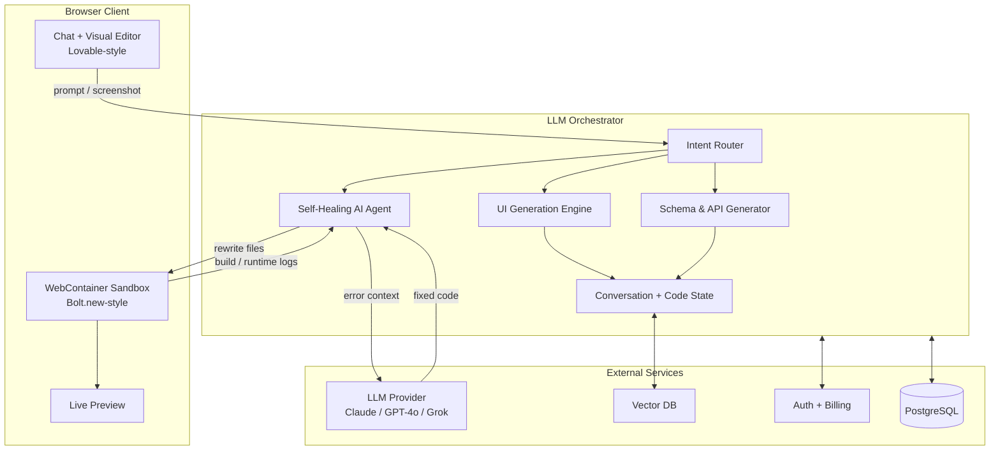

# OmniDev System Architecture (v0.2)

## 1. High-Level Architecture

## 2. Packages

### `@omnidev/core` — Self-Healing Agent
Автономный цикл: ловит ошибки → спрашивает LLM → переписывает файлы → ретраит.

### `@omnidev/webcontainer` — WebContainer Manager
Boot, mount, install, run, stream terminal, server-ready events.

### `@omnidev/orchestrator` — Central Brain
Классификация intent, роутинг, поддержание state, координация всех движков.

### `@omnidev/web` — Frontend
Чат слева + живое превью справа. Тёмный, минималистичный UI.

## 3. Data Flow

1. User → Chat
2. Orchestrator.classifyIntent()
3. Соответствующий handler генерирует/правит файлы
4. WebContainerManager.mount() + startDevServer()
5. SelfHealingAgent следит за терминалом
6. Preview URL появляется в iframe

## 4. Master Plan

### Phase 0 – Foundation ✅
- [x] Monorepo structure
- [x] Self-Healing Agent
- [x] WebContainer Manager
- [x] Orchestrator skeleton
- [x] Chat + Preview UI

### Phase 1 – MVP (сейчас)
- [ ] Реальное подключение LLM (Grok / Claude / OpenAI)
- [ ] Полный цикл create_app → preview
- [ ] Conversational editing без поломки состояния
- [ ] Экспорт в GitHub

### Phase 2 – Database & API
- [ ] Natural language → Prisma
- [ ] Auto tRPC / Route Handlers
- [ ] Neon / Supabase provisioning

### Phase 3 – Visual & Web3
- [ ] Screenshot → Code
- [ ] Полные Web3-шаблоны
- [ ] Design system awareness

### Phase 4 – SaaS
- [ ] Multi-tenant
- [ ] Billing
- [ ] Teams
- [ ] Marketplace

## 5. Security

- Пользовательский код выполняется только внутри WebContainer (клиент)
- Сервер никогда не запускает код пользователя
- LLM-вызовы rate-limited
- Secrets инжектятся только в контейнер пользователя
