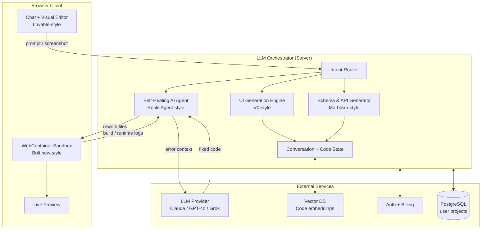

# OmniDev System Architecture

## 1. High-Level Architecture (Mermaid)

## 2. Component Responsibilities

### 2.1 Frontend Engine (UI Generation)
- Accepts text prompt **or** screenshot / wireframe.
- Uses multimodal LLM + visual deconstruction pipeline.
- Outputs modular React components with Tailwind + Shadcn UI + Lucide icons.
- Maintains component tree and design tokens so conversational edits never break the whole app.

### 2.2 WebContainer Sandbox (Client-side Runtime)
- Powered by StackBlitz WebContainers (WASM-based Node.js).
- Runs Vite / Next.js, installs npm packages, starts dev server — all inside the browser.
- Zero server compute for compilation and hot-reload.
- Streams terminal output and runtime errors back to the Self-Healing Agent.

### 2.3 Self-Healing AI Agent (Loop-error fixer)
- Orchestrator that watches WebContainer terminal.
- On any build or runtime error:
  1. Captures full error log + relevant file contents.
  2. Builds a precise “fix this” prompt with context.
  3. Sends to LLM.
  4. Receives patched file(s).
  5. Writes them into the WebContainer filesystem.
  6. Triggers rebuild.
- Repeats until success or max iterations (default 8).
- User never sees raw error logs — only the final working application.

### 2.4 Database & API Generator
- Parses natural-language business logic.
- Generates Prisma schema, migrations, and type-safe API routes (tRPC / Next.js Route Handlers).
- Optionally provisions a real PostgreSQL instance (Neon / Supabase) or uses an in-browser SQLite for demos.

### 2.5 Web3-Native Layer
- Ready-made templates for:
  - wagmi + viem
  - RainbowKit
  - ethers.js / viem contract interactions
- One-click “Add wallet connect + smart-contract interaction”.

## 3. Data Flow for a Typical Session

1. User types: “Create a SaaS dashboard with Stripe billing and wallet login”.
2. Intent Router classifies the request.
3. UIGen creates the React frontend.
4. DBGen creates Prisma schema + API.
5. Files are written into WebContainer.
6. WebContainer runs `npm install && npm run dev`.
7. If errors appear → Self-Healing Agent loops until clean.
8. Live preview appears.
9. User continues with conversational edits (“make the primary button rounder and connect it to the wallet”).

## 4. Master Development Plan

### Phase 0 – Foundation (Week 1-2)
- [x] Repository & monorepo structure
- [ ] Core Self-Healing Agent (this commit)
- [ ] Basic WebContainer integration skeleton
- [ ] Simple chat UI

### Phase 1 – MVP (Week 3-6)
- UI generation from text (React + Tailwind + Shadcn)
- WebContainer full lifecycle (install → build → preview)
- Self-healing loop fully working
- Basic conversational editing
- Single-project persistence (localStorage + GitHub export)

### Phase 2 – Database & API (Week 7-9)
- Natural language → Prisma schema
- Auto-generated tRPC / Route Handlers
- In-browser SQLite + optional Neon Postgres
- Authentication templates (Clerk / NextAuth)

### Phase 3 – Visual & Advanced (Week 10-12)
- Screenshot / wireframe → code pipeline
- Design system / component library awareness
- Web3 templates (wagmi + RainbowKit)
- Multi-file intelligent editing with AST awareness

### Phase 4 – SaaS Scale (Month 4+)
- Multi-tenant project storage
- Team collaboration & real-time presence
- Usage-based billing + rate limiting
- Private LLM fine-tuning on successful projects
- Enterprise self-hosted option
- Marketplace of templates & agents

## 5. Technology Stack

| Layer              | Choice                                      |
|--------------------|---------------------------------------------|
| Frontend           | Next.js 15 / React 19 + Tailwind + Shadcn   |
| Runtime            | WebContainers (StackBlitz)                  |
| Orchestrator       | Node.js + TypeScript                        |
| LLM                | Claude 4 / GPT-4o / Grok (switchable)       |
| DB (platform)      | PostgreSQL + Prisma                         |
| Vector             | pgvector / Pinecone                         |
| Auth               | Clerk or Auth.js                            |
| Deploy             | Vercel / Cloudflare Workers                 |

## 6. Security & Isolation

- Every user project runs inside an isolated WebContainer.
- Server never executes user code.
- LLM calls are rate-limited and sanitized.
- Secrets (API keys, DB URLs) are injected only into the user’s own container.
